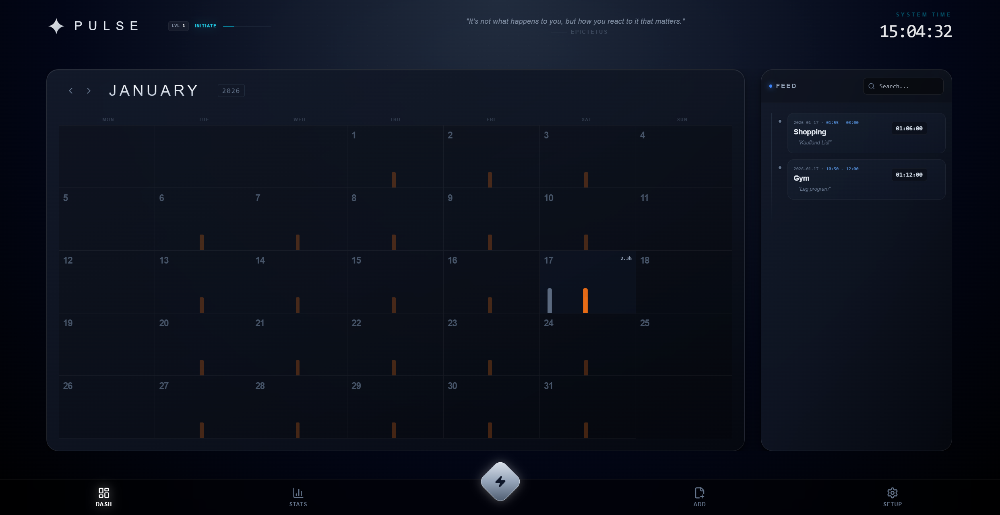

# PULSE v1.5.0
> *Bio-Digital Focus Enhancement Environment*

## 📥 DOWNLOAD LATEST (v1.5.0)

### 🪟 WINDOWS
*Universal Support (x64 & ARM64)*

| 💿 **INSTALLER** | 🎒 **PORTABLE** |
| :---: | :---: |
|  |  |
| *Recommended* | *No Install Required* |

### 🐧 LINUX

| PACKAGE TYPE | 💻 **x64** (Intel/AMD) | ⚡ **ARM64** (RPi / Mac VM) |
| :--- | :---: | :---: |
| **.DEB**   *(Ubuntu, Debian)* |  |  |
| **.RPM**   *(Fedora, RHEL)* |  |  |

 

**PULSE** is a high-performance **Daily Activity & Focus System**. It is designed to quantify **everything you do in your day**—from coding and building to fitness and logistics.

> *"If you can measure it, you can master it."*

---

## 🏗️ SYSTEM ARCHITECTURE
The system is built as a high-performance desktop application:

### PULSE VISUAL (`/reactapp`)
> *The Flagship Experience*
- **Tech Stack:** React, Electron, TailwindCSS, Recharts.
- **Features:**
  - 💎 **Glassmorphic UI:** A stunning, futuristic interface in Dark or Light mode.
  - 🌓 **Dual-Theme Engine (v1.5):** 
    - **Dark Protocol:** The signature deep space interface.
    - **Frost & Platinum:** A monochromatic, high-contrast Light Mode.
    - **System Sync:** Auto-detects your OS theme preference.
  - 🏆 **Gamification Engine:** Earn XP, Level Up, and unlock Ranks (Initiate -> Architect).
  - 📊 **Analytics Vault:** "Command Center" for statistics and data management.
  - 💾 **Local Vault:** 100% private JSON/CSV storage.
  - 🧘 **Focus Matrix:** Multiple clock styles (Retro Flip, Zen, Terminal).

---

## 🛠️ INSTALLATION & DEPLOYMENT

### 🪟 WINDOWS (Primary Support)
1. Navigate to `\reactapp`.
2. Run `npm install` (first time only).
3. **Development:** Run `npm run dev` for hot-reload.
4. **Production Build:** Run `npm run electron:build` to generate a `.exe` installer.

---

### 🐳 DOCKER (Universal / Server)
*Ideal for shared access on a local network (LAN).*

1. Navigate to `\reactapp`.
2. Run: `docker-compose up -d --build`
3. Access the app via browser at: `http://localhost:5173`
   * *(Or use your PC's IP address to access from Tablet/Phone)*

---

### 🐧 LINUX / 🍎 MACOS
*Requires Node.js installed.*

1. Navigate to `/reactapp`.
2. Run `npm install`.
3. Run `npm run dev` to start the web interface.
   * *Note: Electron builds for Linux are possible via `npm run electron:build:linux` but untested.*

---

## 🎮 GAMIFICATION RULES
- **1 Hour** = 100 XP
- **Level Up** every 1000 XP (10 Hours).
- **Ranks:**
  - `LVL 01-09`: **INITIATE**
  - `LVL 10-24`: **OPERATOR**
  - `LVL 25-49`: **NETRUNNER**
  - `LVL 50-99`: **VANGUARD**
  - `LVL 100+`: **ARCHITECT**

## 📜 HISTORY & UPDATES
For a detailed breakdown of changes, features, and daily progress, view the [**Development Log (CALENDAR)**](./CALENDAR.md) or the [**Full Changelog**](./CHANGELOG.md).

## ❤️ ACKNOWLEDGEMENTS
Special thanks to the community for their feedback and support:
- **[@giwgos99](https://github.com/giwgos99)**: For identifying critical bugs in the Focus Mode logic and suggesting the CSV Import feature.

---
*System Version: 1.5.0 "Frost & Platinum"*
